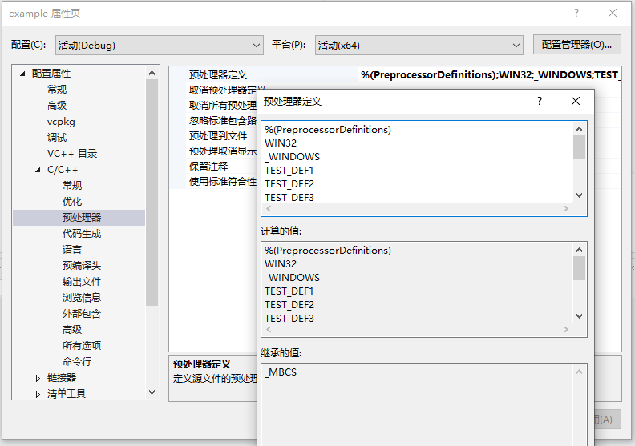

CMake预处理器宏
===============

.. attention::

  ``target_compile_definitions`` 需要写在 ``add_executable`` 后面

CMakeLists
----------

.. code-block:: cmake
  :emphasize-lines: 29-39

  cmake_minimum_required(VERSION 3.10)

  project( example )

  # 设置动态库文件路径
  set( SHARED_LIB_SOURCES 
    src/ExampleSharedLibrary.cpp
  )

  set( EXE_SOURCES
    src/main.cpp
  )

  # 添加动态库
  add_library( example_shared_library SHARED
    ${SHARED_LIB_SOURCES}
  )

  # 添加动态库头文件目录
  target_include_directories( example_shared_library
    PUBLIC
      ${PROJECT_SOURCE_DIR}/include
  )

  # 添加输出列表
  add_executable( example ${EXE_SOURCES} )

  # 添加 预处理
  target_compile_definitions(example PRIVATE TEST_DEF1)
  target_compile_definitions(example PRIVATE TEST_DEF2)
  target_compile_definitions(example PRIVATE TEST_DEF3)

  target_compile_definitions(example 
                              PRIVATE 
                              TEST_DEF4
                              TEST_DEF5
                              TEST_DEF6
                              TEST_DEF7)

  # 添加主项目头文件
  target_include_directories( example 
    PRIVATE
      ${PROJECT_SOURCE_DIR}/include
  )

  # 链接
  target_link_libraries(example 
    PRIVATE
      example_shared_library
  )

使用Visual Studio查看
---------------------

