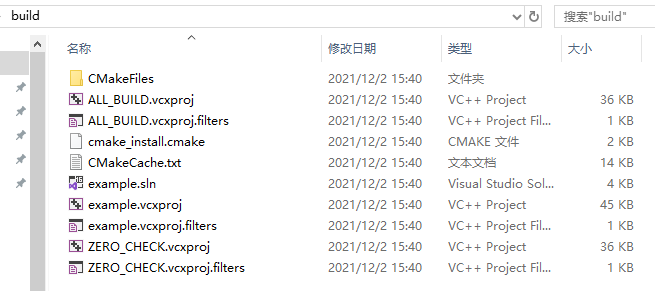

Hello CMake 
===========

环境搭建
--------

1. ubuntu 

.. code:: shell

  sudo apt-get install cmake
  sudo apt-get install gcc
  sudo apt-get install g++

2. Windows

 - 安装 ``Visual Studio 2017 +``
 - 安装 ``CMake-gui 3.10 +``

编写CMakeLists.txt文件
----------------------------

.. code:: shell

  # 指定 CMake 最低版本
  cmake_minimum_required(VERSION 3.10)

  # 指定项目名称
  project(example)

  # 导出文件
  add_executable(example main.cpp)

编写c++文件
-----------

.. code:: cpp

  #include <iostream>
  using namespace std;

  int main(void) {
    cout << "hello world!" << endl;
    return 0;
  }

文件如下:

.. code:: shell

  .
  ├── CMakeLists.txt
  └── main.cpp

  0 directories, 2 files

配置构建
--------

- 命令

.. code:: shell

  mkdir build 
  cd build
  cmake configure ..

- linux build目录

.. code:: shell

  .
  ├── CMakeCache.txt
  ├── CMakeFiles
  │   ├── 3.10.2
  │   │   ├── CMakeCCompiler.cmake
  │   │   ├── CMakeCXXCompiler.cmake
  │   │   ├── CMakeDetermineCompilerABI_C.bin
  │   │   ├── CMakeDetermineCompilerABI_CXX.bin
  │   │   ├── CMakeSystem.cmake
  │   │   ├── CompilerIdC
  │   │   │   ├── a.out
  │   │   │   ├── CMakeCCompilerId.c
  │   │   │   └── tmp
  │   │   └── CompilerIdCXX
  │   │       ├── a.out
  │   │       ├── CMakeCXXCompilerId.cpp
  │   │       └── tmp
  │   ├── cmake.check_cache
  │   ├── CMakeDirectoryInformation.cmake
  │   ├── CMakeOutput.log
  │   ├── CMakeTmp
  │   ├── example.dir
  │   │   ├── build.make
  │   │   ├── cmake_clean.cmake
  │   │   ├── DependInfo.cmake
  │   │   ├── depend.make
  │   │   ├── flags.make
  │   │   ├── link.txt
  │   │   └── progress.make
  │   ├── feature_tests.bin
  │   ├── feature_tests.c
  │   ├── feature_tests.cxx
  │   ├── Makefile2
  │   ├── Makefile.cmake
  │   ├── progress.marks
  │   └── TargetDirectories.txt
  ├── cmake_install.cmake
  └── Makefile

  8 directories, 29 files

- windows build目录

.. note::
  
  可以使用 ``Visual Studio`` 打开 ``.sln`` 进行调试但需要将启动项目改为主项目(example)

编译
----

.. code:: shell

  # windows
  cmake --build .

  # linux
  make 

  # release
  cmake --build . --config release
