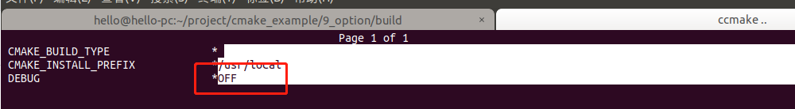
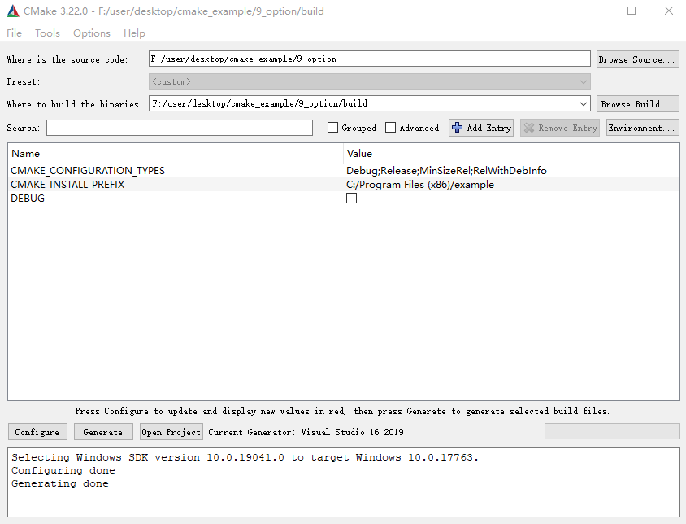
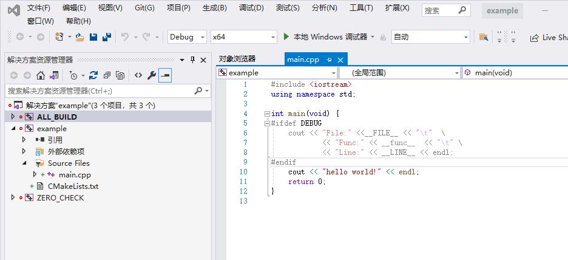

CCMake/CMake-GUI 编译选项
=========================

CMakeLists
----------

.. code-block:: cmake
  :emphasize-lines: 5,9-12

  cmake_minimum_required(VERSION 3.10)

  project(example)

  option(DEBUG "option for debug" OFF)

  add_executable(example main.cpp)

  if (DEBUG)
    target_compile_definitions(example PRIVATE DEBUG)
    message(STATIC "DEBUG = ${DEBUG}")
  endif()

main
----

.. code-block:: cpp
  :emphasize-lines: 5-9

  #include <iostream>
  using namespace std;

  int main(void) {
  #ifdef DEBUG
    cout << "File:" <<__FILE__ << "\t"  \
        << "Func:" << __func__  << "\t" \
        << "Line:" << __LINE__ << endl;
  #endif
    cout << "hello world!" << endl;
    return 0;
  }

CCMake
------

CMake-GUI
---------

